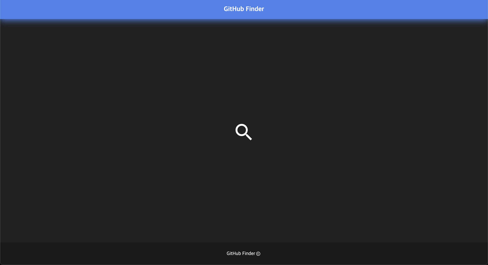

# Github Finder

깃헙유저 찾기 서비스

## 🙇 프로젝트 소개

Github API를 이용한 http 통신을 통해 검색 유저의 정보를 보여주는 서비스입니다.

## ⏱️ 개발 기간

- 2023.10.27 ~ 2023.10.31 (5일)

## 👨 개인 프로젝트

## ⚙️ 기술 스택

- HTML
- CSS
- JavaScript

## 📍 주요 기능

### 1️⃣ 시작화면

첫번째 사진이 꽉 채웠다가 헤더로 변하면서 가운데에 위치한 돋보기 버튼이 보이게 구현하였습니다. 이 돋보기 버튼을 누르면 addEventListener의 콜백함수를 통해 스타일을 추가해, 해당 버튼이 fadeOut으로 사라지고 상단에 검색바가 나타나게 되고 여기서 github api를 이용하여 유저 이름을 검색할 수 있게 구현하였습니다.

### 2️⃣ 검색 결과

api response를 받아서 유저의 사진, 이름 및 유저 정보, 레포지토리 등이 출력되게 구현하였습니다. 깃 차트는 팀원의 도움으로 `https://ghchart.rshah.org/${유저네임}`라는 주소를 이용하면 된다는 정보를 얻고 이를 바탕으로 해당 유저의 깃 차트가 렌더링되게 구현하였습니다.

### 3️⃣ OOP 방식

처음에 절차지향 방식으로 구현한 다음에 객체지향 방식으로 다시 코드를 구현하면서 객체지향 프로그래밍 방식을 배웠습니다. (관련 문제 정리 링크는 하단 노션에 있습니다)

